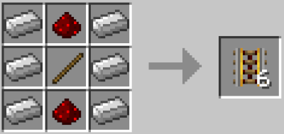

# Railty Lite
Ever wanted to make more rails, but just didn't have the resources?
Want to retrieve farm drops from anywhere automatically?
This is what you're looking for. It's pronounced Rail Tie

A very simple server side rail upgrade for rail addicts. My first BTA mod!

### Features
- Chest minecarts now pick up nearby items
- Rails and Powered Rail default recipes produce twice the output
- An easier Powered Rail recipe that doesn't need gold added

